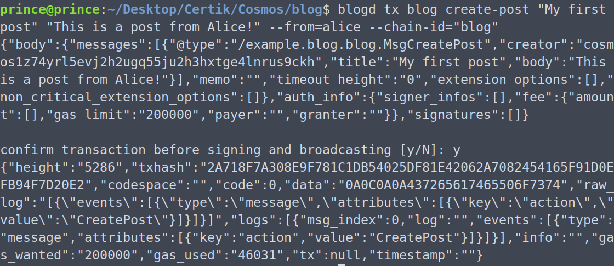
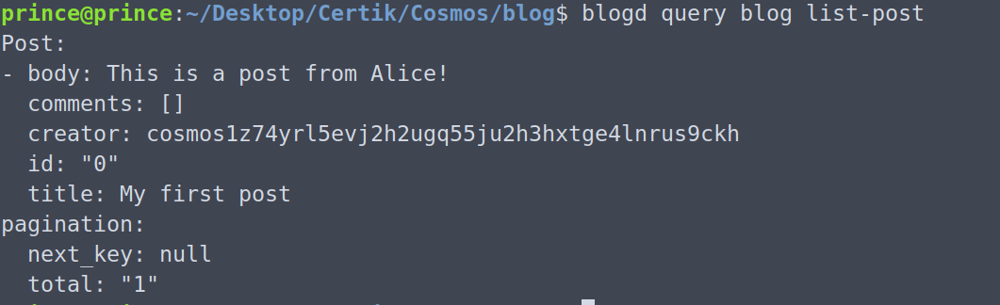
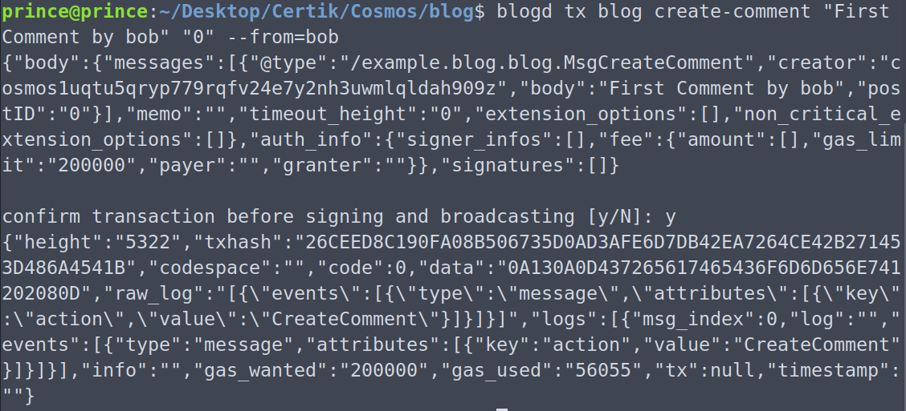
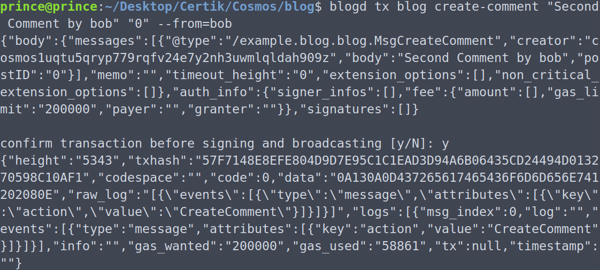
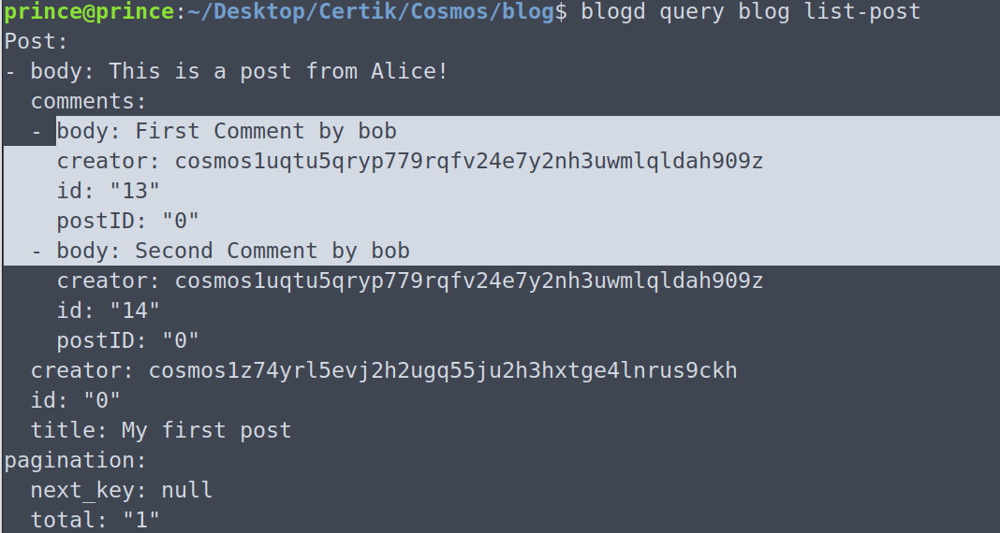
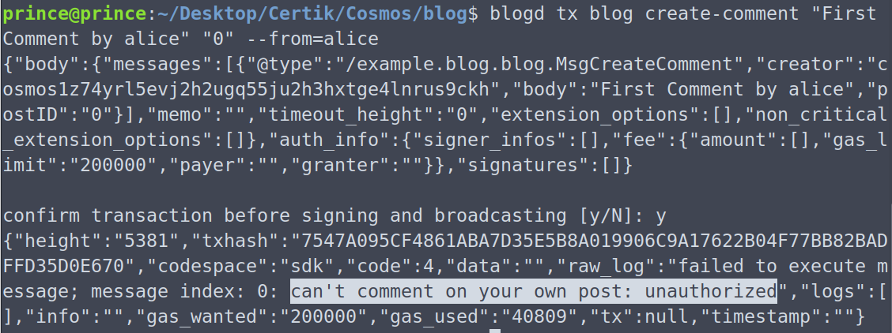
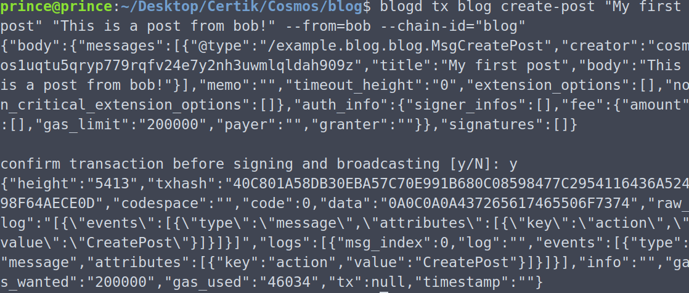
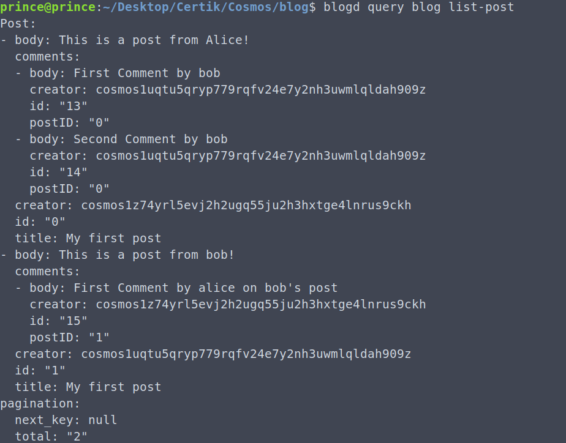
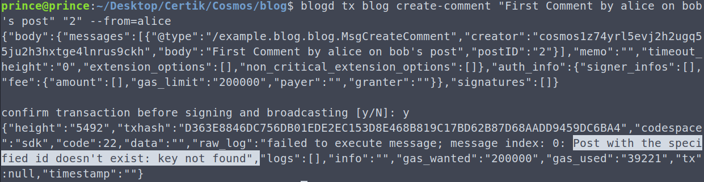
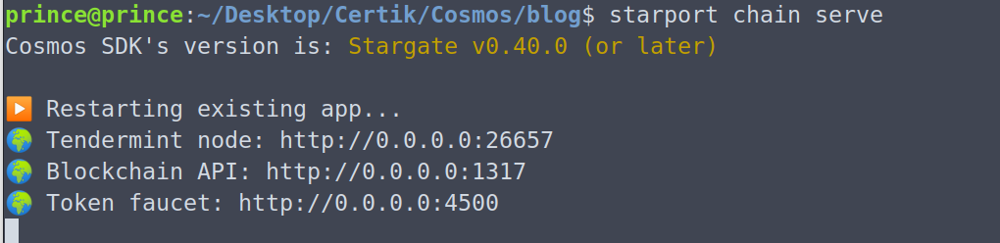

# Blog App Backend

<!-- <table>
  <tr>
     <td><strong>Alice Creates a new post</strong></td>
     <td><strong>List post</strong></td>
  </tr>
  <tr>
    <td></td>
    <td></td>
  </tr>
 </table> -->

### Alice Creates a new post


### List post


### Bob creates a comment



### Bob creates one more comment


### Post with comments


### Alice trying to comment on his own post


### Bob creates a post


### Meanwhile alice also commented on bob's post. All posts


### Trying to comment on a post which doesn't exist


## 💻 Run the project locally
- Clone the repo ```https://github.com/priyanshiiit/Cosmos```
- Change directory to blog using ```cd blog```
- Run the command ```starport chain serve```
### Running



